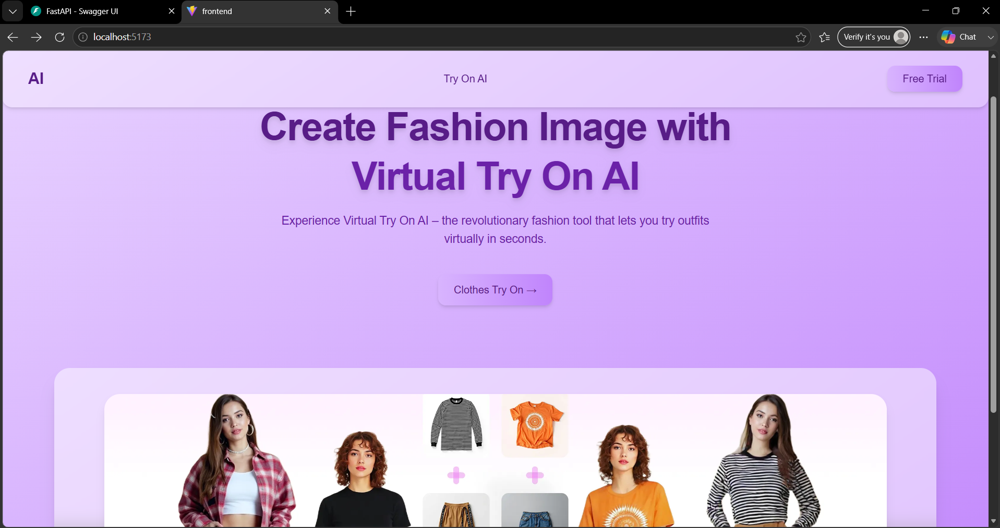
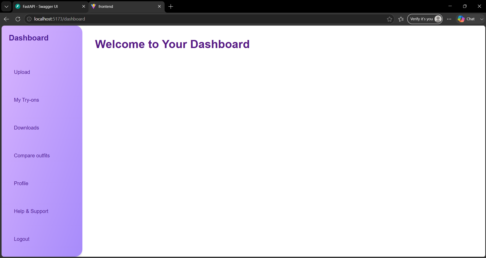
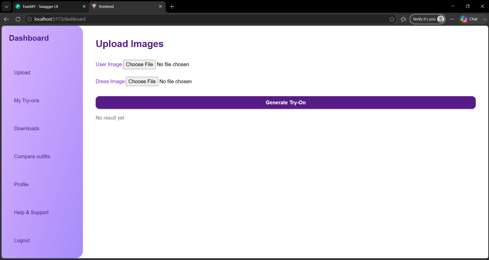
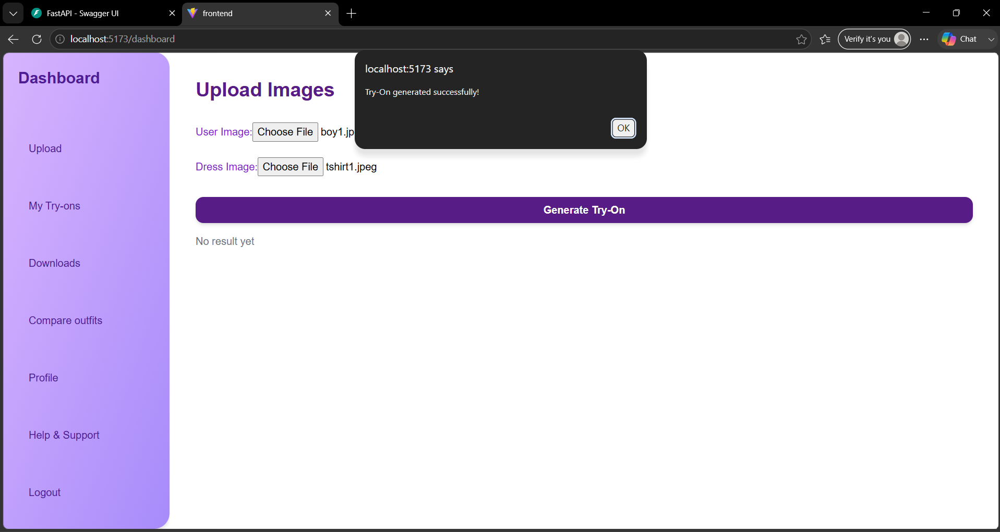
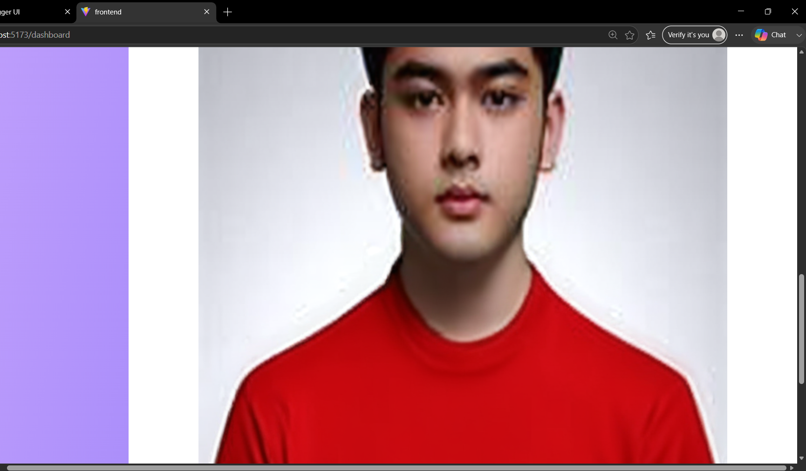
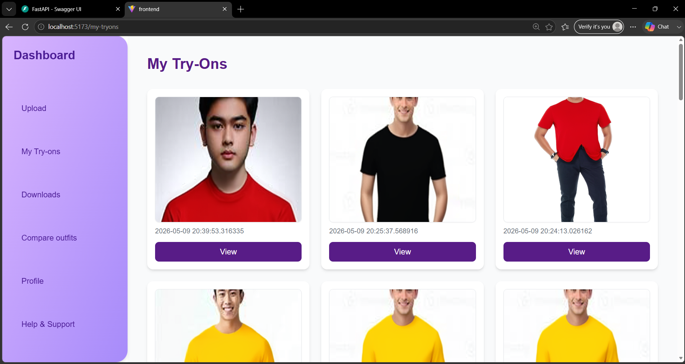
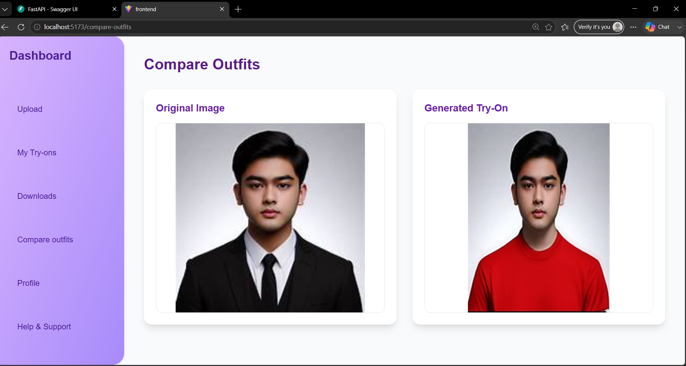

# 👗 Virtual Try-On Project

An AI-powered Virtual Try-On application that allows users to upload a user image and clothing image to generate realistic virtual try-on results using AI models.

---

## 🚀 Features

- Upload user image
- Upload clothing image
- AI-based virtual try-on generation
- Store generated results in PostgreSQL database
- View previous try-on results
- REST API using FastAPI
- Responsive frontend interface

---

## 🛠 Tech Stack

### Frontend
- React.js
- Vite
- Tailwind CSS

### Backend
- FastAPI
- Python
- PostgreSQL
- SQLAlchemy
- Psycopg2

### AI/ML
- Hugging Face API
- IDM-VTON Model

---

## 📂 Project Structure

```text
virtual_tryon_project/
│
├── backend/
│   ├── app/
│   ├── models.py
│   ├── schemas.py
│   ├── database.py
│   └── config.py
│
├── frontend/
│
├── .gitignore
└── README.md
```

---

## ⚙️ Installation

### Clone Repository

```bash
git clone <repository_url>
```

### Backend Setup

```bash
cd backend

python -m venv venv

venv\Scripts\activate

pip install -r requirements.txt

uvicorn app.main:app --reload
```

### Frontend Setup

```bash
cd frontend

npm install

npm run dev
```

---

## 📸 Screenshots

### Home Page



### Dashboard Page



### Upload Page



### Upload Result



### Output



### MyTryOns



### Compare Outfit



---

## 📌 Future Improvements

- Authentication system
- Multiple outfit support
- Recommendation engine
- Cloud deployment

---

## 👩‍💻 Author

Gayathri P